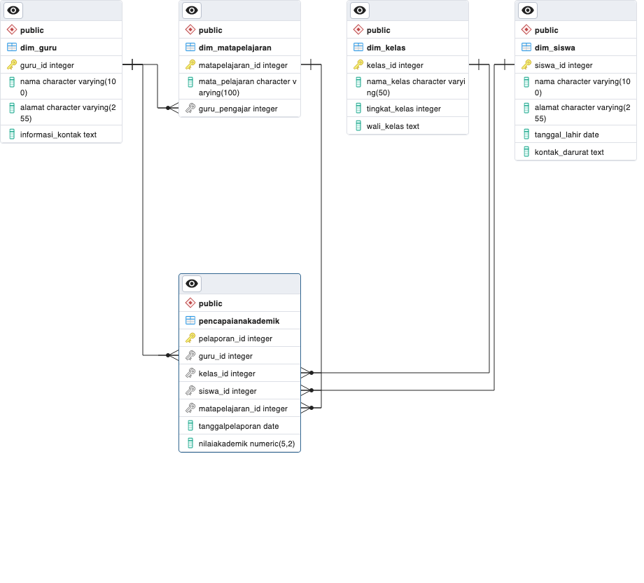

# School-database
Proyek ini adalah database untuk Sekolah Dasar yang dirancang untuk mengelola informasi tentang guru, kelas, mata pelajaran, siswa, dan pencapaian akademik. Database ini memungkinkan Sekolah Dasar untuk memantau performa akademik siswa, informasi guru, dan data kelas dengan bantuan query SQL yang telah diimplementasikan.

# Database-schema
Database ini menggunakan alur star schema dengan terdiri dari 4 tabel dimensi berupa : Tabel Guru, Tabel Kelas, Tabel Mata Pelajaran, Tabel Siswa. untuk tabel faktanya teerdiri dari 1 tabel berupa Tabel Pencapaian Akademik.

# School Management
## 1 Manajemen Guru

- Data guru dapat diakses, diperbarui, dan dihapus.
- Menghubungkan guru dengan kelas yang diajar.
- Memantau informasi kontak guru.

## 2 Manajemen Kelas

- Data kelas dapat diakses, diperbarui, dan dihapus.
- Mengidentifikasi guru wali kelas.
- Melacak tingkat kelas.
  
## 3 Manajemen Mata Pelajaran

- Menyimpan informasi mata pelajaran.
- Mengaitkan guru pengajar dengan mata pelajaran.

## 4 Manajemen Siswa

- Menyimpan data siswa, termasuk informasi kontak darurat.
- Memantau tempat tinggal siswa.

## 5 Pencapaian Akademik

- Merekam pencapaian akademik siswa dalam berbagai mata pelajaran.
- Menghubungkan guru, kelas, siswa, dan mata pelajaran dalam laporan.
- Mencatat tanggal pelaporan dan nilai akademik siswa.
